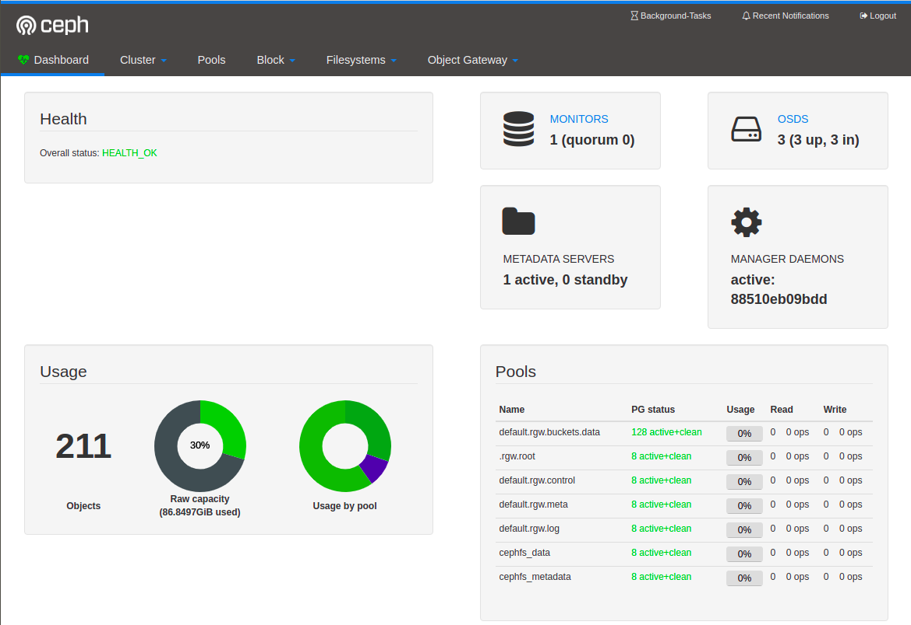

#### Aşağıdaki adımları sırasıyla takip ederek ortamı ayağa kaldırabilirsiniz

~~~
docker-compose up -d ceph-mon ceph-mgr
~~~
~~~
./run_cc.sh
~~~
~~~
docker-compose up -d ceph-osd1 ceph-osd2 ceph-osd3
~~~
~~~
docker-compose up -d ceph-rgw ceph-mds ceph-rbd ||  docker-compose up -d
~~~
~~~
./run_cd.sh
~~~
~~~
watch docker-compose ps
~~~

#### Yeniden kurulum öncesinde aşağıdaki dosyayı çalıştırın
~~~
sudo ./del.sh
~~~

#### Kurulum bitiminde aşağıdaki gibi dashboard ekranına login olabilirsiniz.
~~~
https://host_ip:8443
~~~
~~~
kullanıcıadı= admin
şifre= admin
~~~

ref: [1](https://github.com/VasiliyLiao/ceph-docker-compose)|[2](http://www.dev-share.top/2019/12/24/docker-compose-%E9%83%A8%E7%BD%B2ceph%E9%9B%86%E7%BE%A4/)
